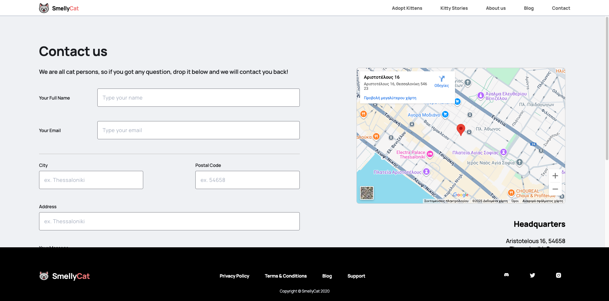
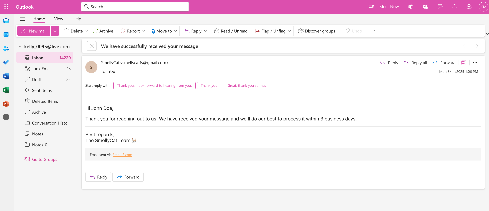
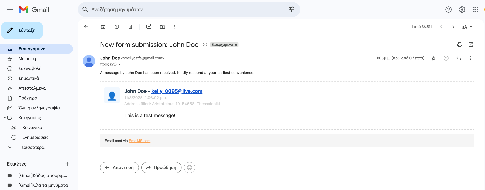

# SmellyCat Website — Current Implementation

## Overview
The current SmellyCat website is in an early development stage. Most pages are **placeholders**, except for the **Contact** page, which is fully implemented.
The site is **fully responsive**, adapting its layout for desktop, tablet, and mobile devices.

---

## Contact Page

### Features
- **Contact Form** allowing visitors to submit messages.
- **Embedded Google Map** showing the company’s location.
- **Email Functionality** powered by [EmailJS](https://www.emailjs.com/).

---

### Form Submission Behavior

When a user submits the contact form:

1. **Confirmation Email to the Visitor**  
   - Confirms that the message has been received.  
   - Example: *"We have received your message and will get back to you shortly."*

2. **Notification Email to the Responsible Person**  
   - Alerts that a new form submission has been received.  
   - Includes the details from the form (name, email, message, etc.).

---
